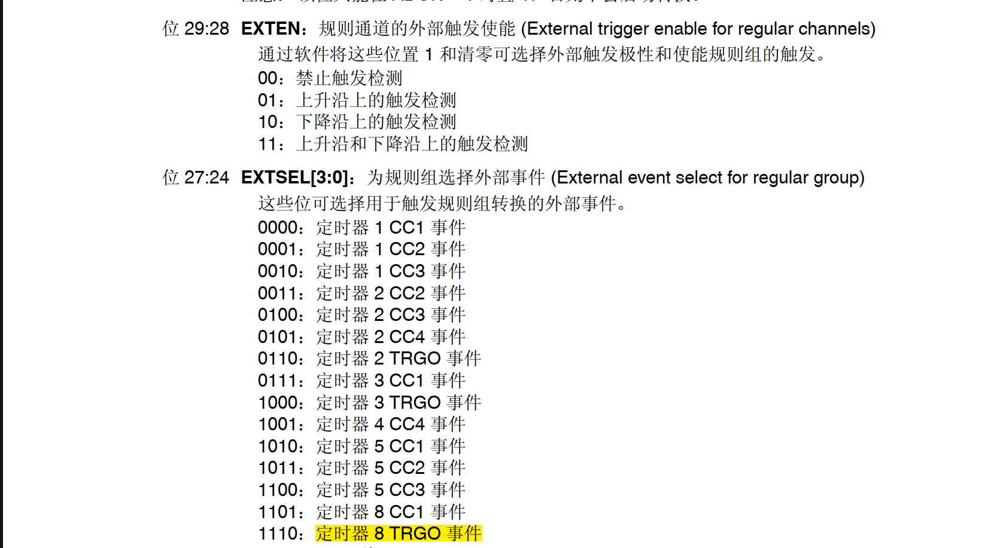

# **ADC**

之前对于adc的认知只停留在最基础的模拟信号转数字信号 实际上对于adc一些细节的配置一直是一知半解 借助这次学习电机控制的机会也算是从头配置了一边adc的底层寄存器 学到了一些之前不了解的知识。

我这里使用adc主要是为了电控服务 需要采集相电流为电机闭环控制做准备 采集反电动势为后面的高级算法做准备，为了防止adc采集数据占用到cpu，导致cpu性能不够 我还配置了dma对于adc采集的数据进行搬运。

详细一点的过程就是先配置adc选择外部触发方式触发adc采样，查阅手册选择上升沿触发，因为当tim8发送完pwm波时会触发更新中断，更新中断又会触发TRGO。而adc就是通过这个TRGO被触发的，这里选择1110，定时器8TRGO触发。一开始我选择的是TIM高级定时器 但是它并不支持TRGO触发adc，后面又更换为tim8。其实tim1应该还可以通过CCx事件来触发adc采样，但是我没有玩明白。

adc配置完后就是配置dma，我在配置过程中一开始老是无法触发dma搬运。主要的原因是选错了dma触发方式，选成了软件触发，每次搬运数据都需要我自己使能dma。dma主要就是选择要搬运数据的目标地址，这里就是adc1；要搬运数据的目标地址，也就是你用来接受adc数据的数组。然后配置好dma的参数即可。

我配置了多个通道，所以我选择的是连续模式。同时，我需要adc采集一次才让dma搬运一次，所以我选择的是单次模式。

## **连续扫描和非连续扫描**

### **1. 扫描模式（Scan Mode）**

#### **定义与特点**

- **多通道自动转换**：扫描模式允许ADC按照预设的顺序依次对多个通道进行转换。一旦启动，ADC会自动切换到下一个通道，无需手动干预1259。
- **通道顺序可配置**：用户可以定义一个通道列表，并设置转换顺序。ADC会严格按照这个顺序对每个通道进行采样和转换179。
- **支持连续或单次转换**：扫描模式可以与连续模式或单次模式结合使用。例如，在连续模式下，ADC会循环扫描所有通道；而在单次模式下，ADC完成一次扫描后会停止259。

#### **应用场景**

- **多传感器数据采集**：适用于需要同时监控多个传感器信号的场景，如温度、压力、湿度等多路传感器的采集125。
- **高效率数据采集**：适合需要快速、高效地采集多个通道数据的应用，如工业自动化、数据采集系统17。

#### **配置与使用**

- **通道配置**：需要预先定义要转换的通道列表，并设置每个通道的转换顺序179。
- **触发方式**：支持软件触发、外部触发或定时器触发259。
- **数据处理**：通常结合DMA（直接内存访问）或中断来处理连续的数据流，以避免数据丢失或覆盖35。

### **2. 非扫描模式（Non-Scan Mode）**

#### **定义与特点**

- **单通道转换**：非扫描模式下，ADC每次只能转换一个通道。转换完成后，需要手动切换到下一个通道或等待外部触发259。
- **手动通道切换**：如果需要转换多个通道，用户需要在每次转换完成后重新配置ADC，选择下一个通道进行转换259。
- **灵活性较低**：适用于只需要单通道转换或对通道切换有特殊需求的场景25。

#### **应用场景**

- **单传感器数据采集**：适用于只需要采集单个通道信号的场景，如读取某个传感器的电压或电流值259。
- **简单控制系统**：适合不需要同时监控多个信号的简单控制系统25。

#### **配置与使用**

- **通道配置**：每次只能配置一个通道进行转换259。
- **触发方式**：支持软件触发、外部触发或定时器触发259。
- **数据处理**：转换完成后，直接读取数据寄存器即可，无需复杂的DMA或中断处理25。

### **3. 扫描模式与非扫描模式的主要区别**

| **特性**         | **扫描模式（Scan Mode）**                    | **非扫描模式（Non-Scan Mode）**        |
| ---------------- | -------------------------------------------- | -------------------------------------- |
| **通道处理能力** | 支持多个通道的自动切换和转换，通道顺序可配置 | 只能处理单个通道，通道切换需要手动配置 |
| **转换顺序**     | 按预设顺序依次转换多个通道                   | 仅转换单个通道，无法自动切换           |
| **适用场景**     | 多传感器数据采集、高效率数据采集             | 单传感器数据采集、简单控制系统         |
| **配置复杂度**   | 较高，需要定义通道列表和转换顺序             | 较低，只需配置单个通道                 |
| **数据处理方式** | 常结合DMA或中断处理连续数据流，提高效率      | 数据直接读取，无需复杂的数据流处理     |
| **触发方式**     | 支持软件触发、外部触发或定时器触发           | 支持软件触发、外部触发或定时器触发     |

### **4. 总结**

- **扫描模式**适用于需要同时采集多个通道数据的场景，能够显著提高数据采集的效率和灵活性，但配置相对复杂。
- **非扫描模式**适用于单通道数据采集或简单控制系统，配置简单，但无法满足多通道自动切换的需求。

选择哪种模式取决于具体的应用需求。如果需要同时监控多个传感器或提高数据采集效率，建议使用**扫描模式**；如果只需要单通道数据采集或对配置复杂度有要求，可以选择**非扫描模式**

## **单次转换和连续转换**

### **1. 单次转换模式（Single Conversion Mode）**

#### **定义与特点**

- **一次转换后停止**：ADC执行一次转换后停止，等待外部触发信号（如软件指令、硬件触发信号）才能启动下一次转换156。
- **触发方式**：支持软件触发、外部触发或定时器触发15。
- **适用场景**：适用于不需要连续采样的应用场景，如某个特定时刻需要读取传感器数据，或者每次只采集一个数据点5。

#### **应用场景**

- **简单数据采集**：如读取温度或电压的单次测量。
- **偶尔采样**：如系统初始化时的校准测量或特定事件触发时的单次测量15。

#### **配置方式**

- **软件触发**：通过写入控制寄存器启动转换。
- **硬件触发**：通过外部信号（如定时器事件）启动转换15。

### **2. 连续转换模式（Continuous Conversion Mode）**

#### **定义与特点**

- **持续转换**：ADC在转换完成后自动开始下一次转换，持续进行，直到被显式停止15。
- **无需手动触发**：一旦启动，ADC会自动循环转换，适合需要实时监测的场景15。
- **触发方式**：由软件启动，或者可以设置为自动循环转换5。

#### **应用场景**

- **实时监控**：如连续监测电池电压、温度或波形采集。
- **高频采样**：适用于需要持续、高效数据采集的应用场景5。

#### **配置方式**

- **软件启动**：通过库函数或寄存器操作启动连续转换。
- **自动循环**：ADC在开启后会自动进行转换，直到手动停止或外部事件触发停止5。

### **3. 两者的区别总结**

| **特性**     | **单次转换模式**               | **连续转换模式**                                          |
| ------------ | ------------------------------ | --------------------------------------------------------- |
| **转换次数** | 每次触发一次转换               | 一直进行转换，直到手动停止                                |
| **停止条件** | 一次转换后停止                 | 必须手动停止或触发停止                                    |
| **适用场景** | 适用于偶尔采样或单次数据采集   | 适用于实时监控或需要持续采样的场景                        |
| **触发方式** | 软件触发、外部触发或定时器触发 | 软件启动或自动循环转换                                    |
| **数据处理** | 转换完成后直接读取数据寄存器   | 通常结合DMA（直接内存访问）或中断处理连续数据流，提高效率 |

### **4. 总结**

- **单次转换模式**适用于简单、单一通道的数据采集，适合偶尔采样的场景。
- **连续转换模式**适用于需要实时、持续采样的应用，适合高频数据采集和实时监控。

选择哪种模式取决于具体的应用需求。如果需要偶尔读取传感器数据，可以选择**单次模式**；如果需要实时监控信号变化，建议使用**连续模式**

