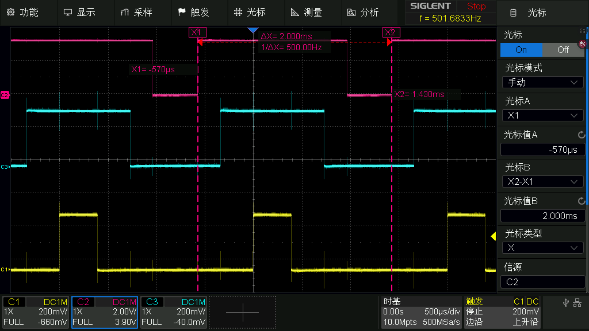
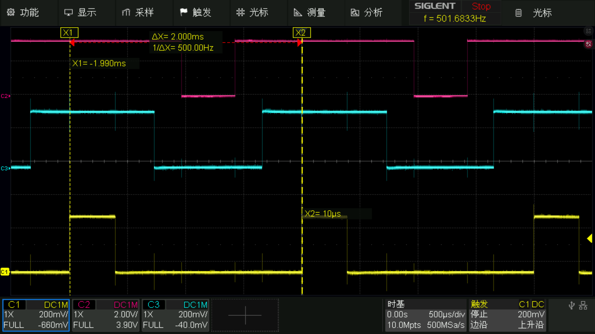
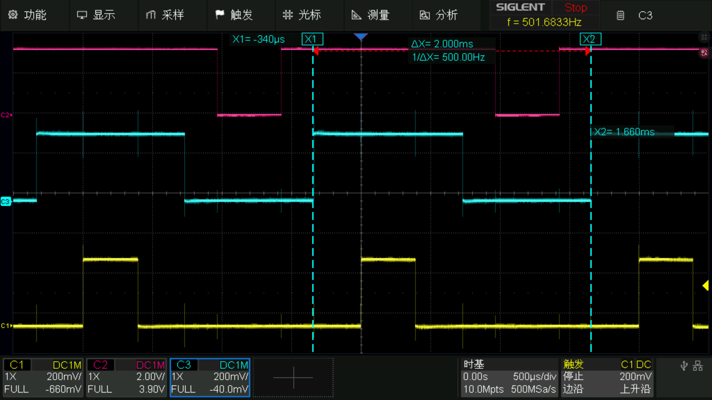
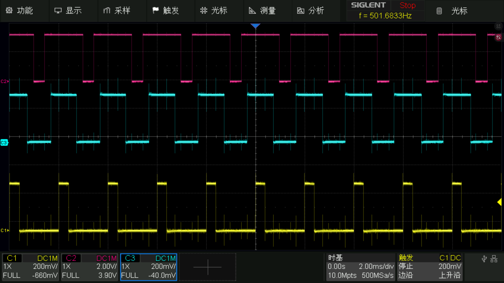

# **TIM**

## 中心对齐模式

在PWM（脉宽调制）技术中，中心对齐模式（Center-Aligned Mode）是电机控制和逆变器应用中常用的配置。根据不同的触发机制和应用需求，中心对齐模式可分为 **模式1**、**模式2** 和 **模式3**。以下是它们的核心区别和适用场景：

### **1. 中心对齐模式的核心差异**

| **模式**  | **触发比较中断的时机**           | **PWM波形对称性**                                   | **典型应用场景**                                     |
| --------- | -------------------------------- | --------------------------------------------------- | ---------------------------------------------------- |
| **模式1** | **仅在向下计数时触发比较中断**   | 波形在周期中心对称，但中断触发时机集中在下半周期    | 需要单一中断触发ADC采样的场景（如FOC电流采样）29     |
| **模式2** | **仅在向上计数时触发比较中断**   | 波形对称性与模式1相同，但中断触发时机集中在上半周期 | 需要ADC采样与上升沿同步的特定场景2                   |
| **模式3** | **向上和向下计数均触发比较中断** | 波形对称性更高，但中断频率加倍                      | 需要高精度采样或复杂时序控制的场景（如多级逆变器）26 |

### **2. 详细说明**

#### **（1）模式1（CMS=01）**

- **触发机制**：
  计数器从0向上计数到最大值（ARR），再向下计数回0。**仅在向下计数时触发比较中断**（即计数器达到ARR后开始下降时）26。

- 波形特性

  ：

  - 若选择**PWM模式1**（向上计数时电平从有效变无效），中心对齐模式下会生成**中间低电平、两侧高电平**的波形（适合需要中间采样低电平的场景）2。
  - 若选择**PWM模式2**（向上计数时电平从无效变有效），则生成**中间高电平、两侧低电平**的波形（适合SVPWM驱动电机）29。

- **应用场景**：
  电机控制中，在PWM周期中间（即计数器为0时）触发ADC采样相电流，以减小谐波干扰46。

#### **（2）模式2（CMS=10）**

- **触发机制**：
  仅在向上计数时触发比较中断（计数器从0到ARR时）。
- **波形特性**：
  与模式1对称性相同，但中断触发时机不同，适合需要在上半周期同步外部事件（如另一组PWM信号）的场景。
- **应用场景**：
  多通道PWM同步控制，或在特定时序下与其他硬件模块协同工作2。

#### **（3）模式3（CMS=11）**

- **触发机制**：
  在向上和向下计数时均触发比较中断，导致每个PWM周期产生两次中断。
- **波形特性**：
  更严格的对称性，但频率为普通模式的一半（因两次计数完成一个周期）26。
- **应用场景**：
  需要高精度电流采样的复杂逆变器系统（如3级逆变器），或需在PWM周期内执行多次任务的应用9。

### **3. 模式选择对PWM频率的影响**

- **中心对齐模式的频率**：
  由于计数器需先向上再向下计数，PWM频率为普通边沿对齐模式的一半26。例如，若ARR=1000，时钟频率为1MHz，则边沿对齐频率为1kHz，而中心对齐模式为500Hz。
- **模式3的额外影响**：
  两次中断触发可能进一步降低系统效率，需权衡中断频率与实时性需求6。

### **4. 实际应用中的建议**

1. **电机控制（FOC/SVPWM）** ：
   优先选择**模式1**，配合**PWM模式2**（中间高电平），并在向下计数时触发ADC采样，可减少电流谐波并简化控制逻辑269。
2. **高频逆变器**：
   若需高采样率，选择**模式3**，但需优化中断处理流程以避免性能瓶颈9。
3. **多级逆变器**：
   结合中心对齐模式和重复计数器（RCR），可灵活控制PWM周期内的采样次数和时序29。

### **5. 总结**

中心对齐模式的本质是通过对称的PWM波形优化电流采样和减少谐波。**模式1**和**模式2**的区别在于中断触发时机，而**模式3**通过双触发机制提升控制精度。选择时需综合考虑硬件性能、中断频率需求和应用场景的对称性要求

## 互补PWM输出

.png)

